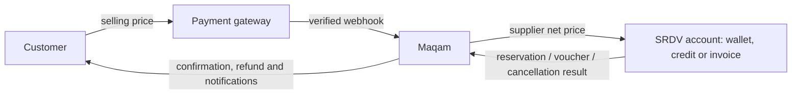
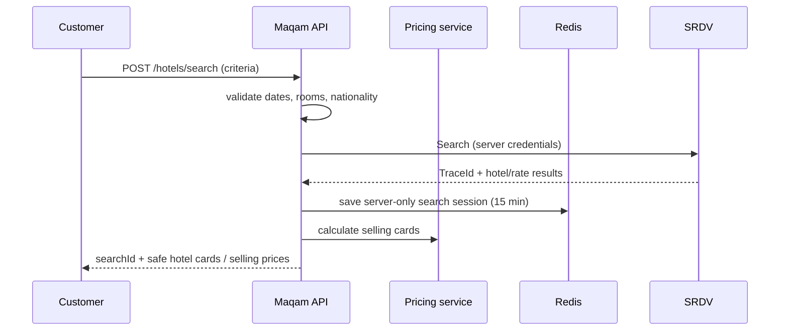
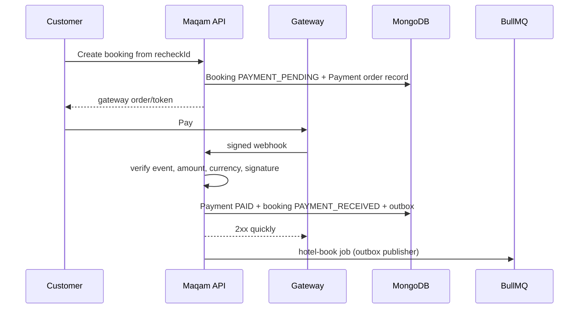
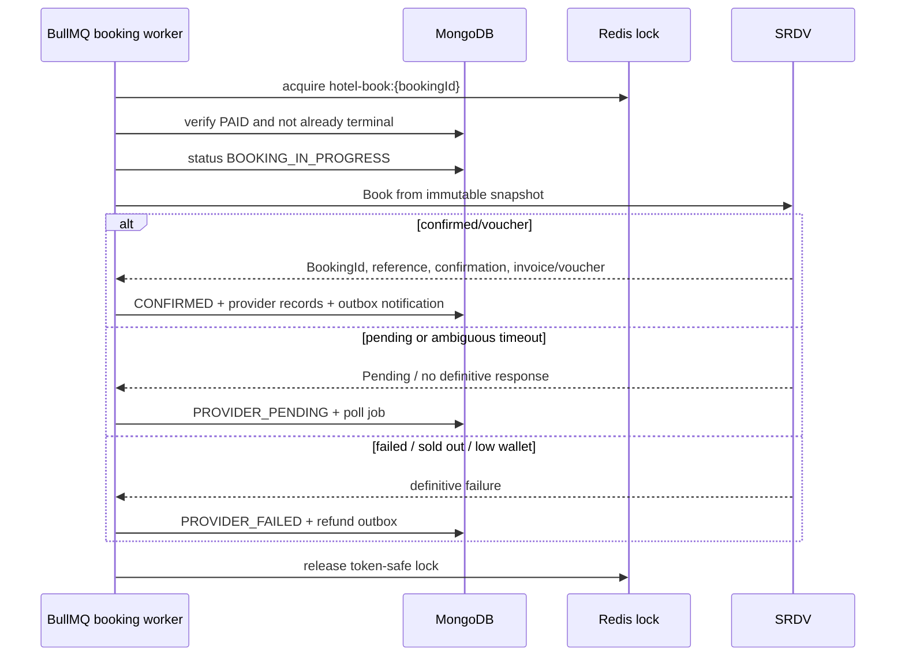
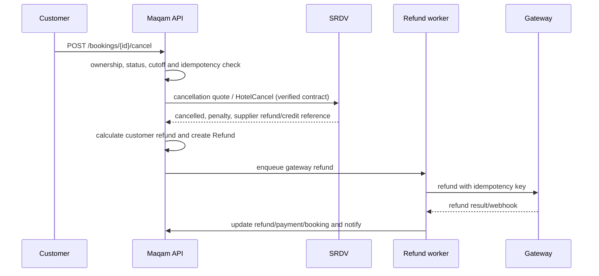
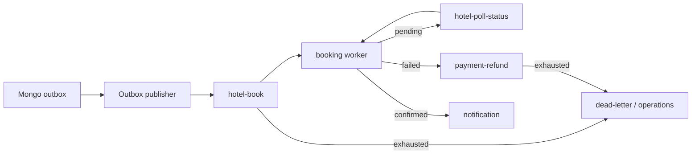
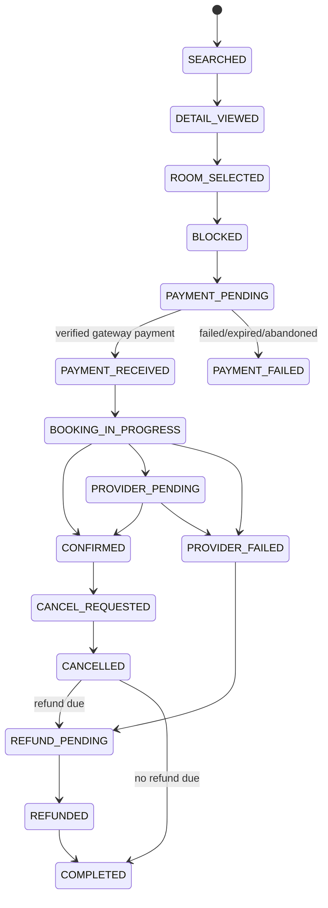

# Production Hotel Booking Architecture

> **Scope:** Maqam Travels hotel booking with SRDV as a supplier. This is the target production design and an audit of the codebase as at 2026-07-16. It is deliberately supplier-neutral at the domain boundary, but uses SRDV API names where SRDV is the provider.
>
> **Important:** SRDV's exact request fields, method paths, response fields, wallet/credit behaviour, and cancellation contract must be validated with the SRDV sandbox and approved Postman collection before live traffic. Never treat an example in this document as an approved SRDV payload.

## 1. Executive decision

A hotel booking has two independent commitments:

1. **Customer payment:** the customer pays Maqam's selling price once through a payment gateway.
2. **Supplier reservation and settlement:** Maqam reserves with SRDV and settles SRDV's supplier amount through Maqam's SRDV wallet, credit facility, or invoice agreement.

Payment is not hotel confirmation. A booking is only `CONFIRMED` after SRDV returns a confirmed/vouchered result. A successful gateway callback must be acknowledged quickly and must enqueue supplier booking work; it must not synchronously call SRDV from the webhook request.



### Current implementation audit

The repository has a sound mock-first starting point but it is **not ready for `HOTEL_PROVIDER=srdv`**:

| Area | Present code | Production requirement |
| --- | --- | --- |
| Routes and validation | `POST /hotels/search`, details, recheck, booking and cancellation routes exist | Add idempotency headers, authenticated ownership for search sessions, OpenAPI, and stable public DTOs. |
| Provider boundary | Provider contract and mock provider exist | `providers/hotels/srdv/srdv-hotel.provider.js` currently returns 503 for every method; implement only from sandbox-verified contracts. |
| Search/recheck cache | `utils/chache.js` is a process-local `Map` with 15/10 minute TTLs | Redis, namespaced keys, ownership checks, size limits and atomic single-use recheck consumption. |
| Booking after payment | `ensureBookingConfirmed()` calls `confirmBookingAfterPayment()` synchronously | Gateway webhook writes payment/outbox only; a BullMQ worker takes the distributed lock and calls SRDV. |
| Pending booking | A helper can poll pending bookings | Schedule durable delayed jobs with bounded retry, supplier-approved intervals and an operations queue. |
| Prices | One `priceSnapshot` and `totalPrice` | Persist supplier, customer, tax, discount, FX, gateway-fee and settlement snapshots separately in minor currency units. |
| Cancellation/refund | Supplier cancellation returns a status only | Obtain final supplier cancellation amount, calculate customer refund by policy, enqueue gateway refund and keep independent supplier/customer refund states. |

The existing `HotelBooking` model, `hotel-search.service.js`, `hotel-booking.service.js`, mock provider, payment model, lock helper, and `hotel-booking-status.worker.js` are useful foundations. The production flow below replaces their synchronous/in-memory parts; it does not claim those changes have already been implemented.

## 2. Clean Architecture and ownership

Use the dependency direction below. Controllers never build SRDV payloads; adapters never decide markup; gateway webhooks never book hotels.

```text
HTTP / Webhook Controller
        ↓
Application service / use case
        ↓
Domain services and ports (pricing, booking, refund, ledger)
        ↓
Infrastructure clients and repositories (Redis, MongoDB, BullMQ, gateway)
        ↓
Provider adapter → SRDV HTTP API
```

| Layer | Responsibility | Must not do |
| --- | --- | --- |
| Controller | Authenticate, validate DTO, set correlation ID, return public response | Pricing, persistence choreography, SRDV payload mapping. |
| Application service | Orchestrate one use case and transaction/outbox boundary | Know Axios, Express or raw provider response shapes. |
| Domain service | Price calculation, state transition validation, refund policy, accounting rules | Call databases or external APIs. |
| Provider port/client | Transport, timeouts, authentication, retries/circuit breaker and provider DTO mapping | Apply Maqam markup or expose raw SRDV data. |
| Adapter | Convert SRDV DTOs to normalized domain objects and normalize errors | Receive browser-controlled supplier fields. |
| Worker | Consume a durable job, acquire lock, run a use case, retry safely | Rely on a request process being alive. |

Suggested modules:

```text
modules/hotels/
  api/                 controller, validators, response DTOs
  application/         search, details, recheck, create-booking, cancel use cases
  domain/              state machine, pricing policy, refund policy, hotel port
  infrastructure/      Mongo repositories, Redis session store, BullMQ producers
providers/hotels/srdv/ client, request mapper, response mapper, SRDV adapter
workers/hotels/        book, poll, cancel, refund, settlement/reconciliation workers
```

## 3. API catalogue

All browser endpoints use Maqam IDs. Browser requests never carry SRDV credentials, `TraceId`, `SrdvIndex`, `ResultIndex`, raw room/rate objects, or a supplier price to be trusted.

| Supplier API | Purpose / when | Required server-side input | Normalized output and data retained |
| --- | --- | --- | --- |
| `Search` | Customer submits a destination/date/guest search | city ID, country, dates, nights, nationality, rooms and child ages | Opaque `searchId`, safe hotel cards; retain full raw result, trace/correlation fields and query criteria in Redis. |
| `HotelInfo` | Customer opens a property when content is absent/stale | Search context plus hotel code | Property description, address, images, facilities, rules; cache supplier content separately. |
| `HotelRoom` | Customer needs sellable rooms/rates for a selected hotel | Valid search context, hotel code and supplier indices | Room/rate snapshot, meal, occupancy, cancellation policy and supplier price; keep server-only. |
| `BlockRoom` | Immediately before creating a payment order | Selected server-side rate, guest nationality, search context | Current price, availability, policy and any block/hold reference; create immutable `recheckId`. |
| `Book` | Worker processes a verified paid booking | Immutable recheck snapshot, guests, supplier correlation data | Supplier booking IDs, voucher/invoice/reference, status, raw encrypted response. |
| `HotelBookingDetail` | Reconcile an ambiguous/pending Book result | Provider booking/reference ID and trace data | Current supplier state and voucher; append provider event/history. |
| `HotelCancel` | Customer/admin cancellation after eligibility checks | Confirmed provider reservation and cancellation request | Supplier cancellation status, charge, refund/credit reference and final policy result. |

Store every request/response as a redacted `SupplierExchange` record: provider, operation, booking/search correlation ID, idempotency key, HTTP outcome, normalized outcome, attempt number, timestamps, and encrypted redacted payload. Never log passwords, authorization, card data, guest PII beyond operational need, or raw credentials.

## 4. Search and details

### Search sequence



`POST /api/v1/hotels/search` accepts city/provider destination ID, country, check-in/out, nationality, currency, rooms and child ages. The server calculates nights; it never trusts a client-supplied night count. Validate that one `RoomGuests` entry exists per requested room and that child ages match the child count.

SRDV Search normally returns a correlation/trace value, supplier indices, hotel code, rooms/rates or minimum rates, policy/meal data and property data. Maqam creates a random opaque `searchId`; it returns only public hotel fields and Maqam's selling price.

```json
{
  "searchId": "b1e6f405-59c0-47a9-8c16-e5b7b4688f4d",
  "expiresAt": "2026-07-16T12:15:00Z",
  "hotels": [{
    "id": "hotel_public_4pL2",
    "name": "Example Makkah Hotel",
    "rating": 4,
    "address": "Makkah, SA",
    "imageUrls": ["https://cdn.example/hotel.jpg"],
    "fromPrice": { "amountMinor": 1100000, "currency": "INR" },
    "priceDisclosure": { "includesTaxes": true, "includesFees": true }
  }]
}
```

Do not expose the supplier net amount. It reveals supplier commercial rates, enables customer-side price tampering, makes promotion logic inconsistent, and allows the client to rebuild supplier Book payloads. A B2B agent may be permitted to see a negotiated price only through a separate role-aware price view; that is still a Maqam price, not raw SRDV data.

### Details and rooms

`GET /api/v1/hotels/:hotelId?searchId=...` first proves that the hotel belongs to the active search. Use `HotelInfo` for content that is not included in Search or whose content cache is stale; use `HotelRoom` to obtain selectable room/rate data for the exact search. Content can be cached longer (for example 24 hours, subject to supplier terms); rates and availability are only search-time hints and must be revalidated by `BlockRoom`.


Public room DTOs show room name, occupancy, meal, inclusions, cancellation text, images and **selling** amount. Preserve the complete provider room object and all correlation fields only in the search session, because the provider often requires them again at Book time.

## 5. Redis session design

Redis is required because search results are short-lived, large and stateful; an API process-local `Map` is lost on restart and cannot work across multiple API instances. MongoDB is the durable audit record, not the high-volume live availability cache.

| Key | Value | TTL | Notes |
| --- | --- | --- | --- |
| `hotel:search:{searchId}` | criteria, owner/anonymous fingerprint, provider, raw normalized supplier context, created time | 15 minutes | Compress/limit oversized results; do not return it directly. |
| `hotel:details:{searchId}:{hotelId}` | selected hotel/room normalized data and provider references | 10–15 minutes | Must not outlive its search context. |
| `hotel:recheck:{recheckId}` | immutable BlockRoom snapshot, accepted price/policy version, hash | 5–10 minutes | Single use; atomically mark consumed when a booking is created. |
| `lock:hotel-book:{bookingId}` | lock token | job timeout + safety margin | Use Redis atomic lock with token-safe release/renewal. |
| `idem:{scope}:{key}` | request hash and resulting resource ID | 24 hours or business policy | Same key with a different request body is a conflict. |
| `ratelimit:*` | counters/sliding window state | configured window | Per IP/user/merchant as appropriate. |

Encrypt or minimize PII in cache, restrict Redis network access, and configure eviction so locks/idempotency are not evicted before noncritical content. On cache expiration, return `410 SEARCH_OR_RECHECK_EXPIRED` and require a fresh search/recheck; never attempt to reconstruct a booking from a stale browser payload.

## 6. Pricing engine

### Formula and immutable quote

All arithmetic uses integer minor units (`paise`, not floating point) and a currency-aware rounding policy. A quote records the exact rule version, FX rate/version, tax jurisdiction, coupon decision and timestamps used.

```text
selling subtotal = supplier payable + markup + service/convenience fee - discount
customer tax     = tax(selling subtotal, jurisdiction, tax rule)
customer total   = selling subtotal + customer tax

gross margin before costs = customer total - supplier payable
net contribution          = customer total - supplier payable - gateway fee - tax liability - refund cost
```

Example: supplier ₹10,000, markup ₹800, convenience fee ₹200, no discount/tax for simplicity: customer total ₹11,000; supplier payable ₹10,000; gross margin before gateway/taxes ₹1,000. The ₹11,000 is not sent to SRDV.

| Scenario | Supplier | Markup | Fee | Discount | Customer total before tax |
| --- | ---: | ---: | ---: | ---: | ---: |
| B2C standard | 10,000 | 800 | 200 | 0 | 11,000 |
| B2B agent contract | 10,000 | 350 | 0 | 0 | 10,350 |
| Promotion capped at margin | 10,000 | 800 | 200 | 500 | 10,500 |
| Supplier drops price | 9,400 | 752 (8%) | 200 | 0 | 10,352 |

Pricing rules should be versioned database documents with scope and precedence: provider → destination/hotel/rate → channel (B2C/B2B) → tenant/agent → travel dates → customer segment. Each has effective dates, fixed or percentage markup, min/max margin, fee/tax applicability, stackability, priority and approval/audit history. Promotions/coupons are separate rules with eligibility, budget, usage limits, exclusions and a deterministic conflict rule (for example, highest eligible non-stackable discount, then stackable discounts). Pricing must be repeatable: save `ruleIds`, versions and calculated components in every recheck/booking snapshot.

When BlockRoom changes supplier price or policy, calculate a new quote. If price increased, do not capture an unapproved difference. If it decreased, either pass on the reduction or use a published guarantee rule; record the decision. If policy changed, require renewed acceptance even when the price is unchanged. If sold out, no payment order is created.

### Recheck / BlockRoom timeline

```mermaid
sequenceDiagram
  participant U as Customer
  participant A as Maqam API
  participant S as SRDV
  U->>A: Select rate, POST /hotels/recheck
  A->>S: BlockRoom using stored supplier context
  S-->>A: availability, current price, policy, hold reference?
  alt changed / policy changed
    A-->>U: revised selling quote; explicit approval required
  else available and unchanged
    A-->>U: recheckId + current selling quote
  end
```

Search at 10:00 for supplier ₹10,000 does not guarantee the rate at 10:15. At recheck, inventory may be gone, price may be ₹10,600, or cancellation policy may change. `BlockRoom` is the final price/availability boundary before payment order creation; it may create a supplier hold only if SRDV explicitly documents that it does and states its expiry. Do not assume it is a hold.

## 7. Booking and payment

### Booking creation

After the customer accepts the most recent recheck, `POST /api/v1/hotels/bookings` atomically consumes the `recheckId` and creates one `HotelBooking` in `PAYMENT_PENDING`. The caller supplies an `Idempotency-Key`; duplicate identical requests return the existing booking/payment intent.

The immutable snapshot includes property/room/rate, all guests, check-in/out, supplier trace/index/booking references, supplier amount, complete customer price breakdown, cancellation policy, policy acceptance version/time, provider payload source data hash, price rule versions and the gateway amount/currency. It must be sufficient to build the SRDV Book request without reading current live search results.

Create the gateway order only from this server-side snapshot. Gateway callbacks must verify signature, event ID, order/capture ID, amount, currency and terminal payment status. A verified payment changes `Payment` to `PAID` and booking to `PAYMENT_RECEIVED` in a DB transaction, writes an outbox event, and returns `2xx`. The outbox publisher adds a `hotel-book` BullMQ job after commit.



Idempotency has three levels: gateway event ID prevents duplicate webhook processing; payment order/capture IDs have unique indexes; booking job ID is deterministic (`hotel-book:{bookingId}`). A distributed lock prevents concurrent workers booking the same hotel. Payment retries leave the same booking in `PAYMENT_PENDING` until the gateway order expires; failed/expired/abandoned payments change payment state and expire/release the booking without supplier Book.

## 8. Supplier booking, pending, confirmation and voucher

Do not call SRDV Book within a webhook: it makes gateway acknowledgement slow, causes ambiguous retries on timeout, and couples payment reliability to supplier availability. The booking worker performs this work.



Normalize provider outcomes:

| SRDV/transport outcome | Booking action |
| --- | --- |
| Confirmed/voucher successful | Store booking/reference/confirmation/invoice/voucher identifiers and document URL/blob; set `CONFIRMED`; notify. |
| Pending | Set `PROVIDER_PENDING`; message customer that confirmation is in progress; schedule `HotelBookingDetail`. |
| Price/policy changed | Do not silently charge more; mark `PROVIDER_FAILED` or `REQUIRES_REAPPROVAL`; refund/void original payment under policy, or create a new approved payment for the difference. |
| Sold out / supplier rejection / wallet balance low | `PROVIDER_FAILED`; create refund decision. Wallet shortage is an internal operations incident, not a customer payment failure. |
| Network timeout / unknown result | `PROVIDER_PENDING`; query booking detail/reconcile before retrying Book. Never blindly resend Book. |

For pending results, use SRDV's approved interval; a conservative initial plan is 5, 10, 20 and 30 minutes, then operations review, with a hard SLA/maximum deadline agreed with SRDV. Each poll has deterministic job ID and stores attempt/result. A pending booking is not confirmed or vouchered until `HotelBookingDetail` returns a terminal confirmed outcome. Notify the customer at payment received, pending, confirmed, failed and refund initiated/completed states without promising a room before confirmation.

## 9. Cancellation and refund

Cancellation first resolves the supplier result, then calculates the customer result. Maqam's stored cancellation text is an audit snapshot; it is not proof of live supplier eligibility or final charge.



`CANCEL_REQUESTED` is used until the supplier's terminal response. A full supplier refund, partial refund, no refund and supplier penalty are all possible. Customer refund policy must be disclosed before purchase and implemented as versioned rules: for example refundable supplier amount less disclosed non-refundable convenience fee and any lawful deductions. Markup is normally part of the customer charge and may be refunded fully, partially or not at all only according to the disclosed policy and applicable law; it cannot be retained arbitrarily. Gateway fees are Maqam costs unless the customer terms/law validly permit treatment otherwise. Keep supplier recovery and customer refund independent: SRDV may credit Maqam later even if Maqam refunds the customer immediately.

If cancellation succeeds but gateway refund is delayed, booking remains `CANCELLED` while the `Refund` remains `PENDING`; never revert supplier cancellation because a gateway call failed. Retry refund with gateway idempotency and send it to the dead-letter/finance queue after exhaustion.

## 10. Settlement and accounting

SRDV settlement is commercial-account specific. Confirm whether SRDV uses prepaid wallet, credit line, postpaid invoice or another mechanism, including insufficient-balance errors and statement access. Reconcile daily by supplier booking ID/reference/invoice, currency, amount and dates.

| Account/event | Debit | Credit |
| --- | ---: | ---: |
| Captured customer payment | Gateway clearing | Customer cash receipt / liability allocation |
| Confirmed supplier reservation | Supplier cost / COGS | SRDV wallet reduction or supplier payable |
| Gateway fee | Payment processing expense | Gateway clearing/payable |
| Output tax liability | Revenue/consideration allocation | Tax payable |
| Customer refund | Refund expense/revenue reversal | Gateway clearing/refund payable |
| Supplier refund/credit | SRDV receivable/wallet | Supplier cost recovery |

The exact journal chart, revenue recognition point and GST treatment must be approved by Maqam's finance/tax adviser. Store immutable ledger entries rather than updating a balance in place; a correction is a compensating entry. Reconciliation identifies: confirmed booking with no supplier debit, supplier debit with no local booking, payment captured but no booking/refund, duplicate provider reference, and refund mismatches.

## 11. MongoDB design

| Collection | Key fields / indexes | Purpose |
| --- | --- | --- |
| `HotelBooking` | `userId, createdAt`; `status, nextActionAt`; unique provider/reference when present; `recheckId` | Durable aggregate and immutable booking snapshot. |
| `Payment` | unique sparse gateway order/capture/event IDs; `bookingId,status`; `idempotencyKey` | Customer gateway lifecycle and refund totals. |
| `Refund` | unique gateway refund/idempotency ID; `bookingId,status` | Explicit refund workflow; do not embed all operational state only in payment. |
| `SupplierExchange` | `provider, operation, correlationId, createdAt` | Redacted encrypted provider request/response audit. |
| `BookingEvent` | `bookingId, sequence`; `createdAt` | Append-only status/audit trail, actor and correlation ID. |
| `PricingRule`, `Coupon` | scope/effective dates/status/priority | Versioned pricing and promotion configuration. |
| `LedgerEntry`, `Settlement`, `SupplierWalletTransaction` | provider/reference/date/currency | Accounting, reconciliation and settlement evidence. |
| `NotificationLog` | event/idempotency/recipient/channel | Delivery/audit and safe retries. |
| `OutboxEvent` | `status,nextAttemptAt`; unique aggregate/event key | Atomic hand-off from Mongo transaction to queues. |

Use MongoDB transactions for changes that must commit together (payment status + booking state + outbox event). Use references for high-volume logs/exchanges, embed immutable booking subdocuments that must travel together, and encrypt PII/raw supplier payloads at rest. Add TTL only to genuinely disposable records, never bookings, payments, settlement or audit evidence.

## 12. Queues, retries and resilience

BullMQ queues: `hotel-book`, `hotel-poll-status`, `hotel-cancel`, `payment-refund`, `notification`, `supplier-settlement-reconcile`, and one dead-letter queue per operational class. Jobs use deterministic IDs, exponential backoff with jitter, bounded attempts, correlation IDs and payloads containing only resource IDs—not complete guest/supplier snapshots.



Provider client controls: short connect/read timeouts, request IDs, retry only idempotent safe operations or operations with supplier-supported idempotency, per-provider rate limits, circuit breaker and bulkhead concurrency. A `Book` timeout is ambiguous: do not retry until booking-detail/reconciliation proves no booking exists. Alert on circuit-open, pending-SLA breach, low wallet, refund failure and reconciliation mismatch.

## 13. Booking state machine

`DETAIL_VIEWED` and `ROOM_SELECTED` are normally UI/search-session events, not durable booking statuses. Persist them only if analytics requires them. `SEARCHED` is likewise a Redis/session event. Durable statuses begin when a booking is created.



Payment status is a separate state machine (`CREATED`, `PENDING`, `PAID`, `FAILED`, `EXPIRED`, `PARTIALLY_REFUNDED`, `REFUNDED`, etc.). Do not overload booking status to represent gateway outcome. A booking becomes `COMPLETED` only after checkout/service completion and no unresolved financial/supplier process, not immediately after confirmation.

## 14. Security and compliance

- JWT authentication and RBAC protect bookings, support actions, finance refunds and pricing administration. Enforce resource ownership on every customer booking/search operation.
- Keep SRDV/gateway credentials in a managed secrets store; rotate, mask and never return them. Require TLS, network allowlisting and `EndUserIp` controls as SRDV requires.
- Verify gateway webhook signatures against the raw body; enforce timestamp/replay protection and persist gateway event IDs before side effects.
- Use allow-list DTO validation, length limits, date/occupancy/guest validation, output encoding and API rate limits. Do not use client price, status, provider IDs or booking payload as authority.
- Tokenize card handling through gateways; Maqam must not store PAN/CVV. Confirm PCI scope with the gateway/compliance adviser.
- Audit all price-rule changes, manual booking/refund/cancellation actions, state transitions and finance overrides with actor, reason, before/after values and correlation IDs.

## 15. Production readiness checklist

1. Obtain SRDV sandbox credentials, IP whitelist, method payloads/paths, permitted currencies/modes, voucher mode, cancellation and settlement documentation.
2. Implement SRDV client/adapter mapping and contract tests from sandbox fixtures; keep the mock provider as a deterministic test double.
3. Replace in-memory cache and Mongo lock fallback with Redis session, idempotency and lock infrastructure; add BullMQ and transactional outbox.
4. Expand price, booking, refund, supplier-exchange, ledger and settlement schemas with minor-unit money and immutable snapshots.
5. Move supplier Book/cancel/refund work to workers; implement pending polling and reconciliation before enabling production payment capture.
6. Test: price/policy change, sold out, provider pending, low wallet, Book timeout, duplicate click, duplicate webhook, worker crash, cancellation full/partial/no refund, gateway refund failure and supplier/customer reconciliation mismatch.
7. Add dashboards/alerts, operations runbooks, finance reconciliation, data retention, incident escalation and customer communication templates.

## Related repository documents

- [SRDV Hotel API Analysis](/modules/srdv-hotel-api-analysis) — verified/verification-required SRDV method analysis.
- [SRDV Hotel Booking and Settlement Flow](/modules/srdv-hotel-booking-settlement-flow) — concise supplier settlement design.
- [Payments gateway architecture](/modules/payment-gateway-architecture) — existing gateway integration details.
