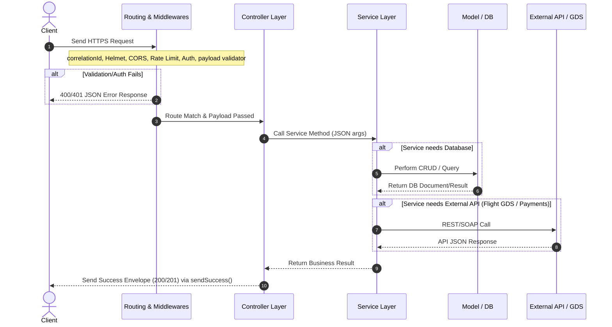

# System Architecture

This document describes the architectural flow, component relationships, and data pathways for the MaqamTravels backend engine.

## Request Execution Flow

Every HTTP request sent to the API traverses a layered pipe. This ensures logging, rate-limiting, security validation, and error traps are consistently applied:



---

## Architectural Layers

### 1. HTTP Routing & Middleware Layer
All requests hit `app.js` first:
* **`correlationIdMiddleware`:** Inject a unique UUID into `req.id` and pass it down. Every log line records this ID to enable request tracing.
* **Security Headers:** `helmet()` sets secure HTTP headers.
* **CORS:** Configured explicitly to allow cross-origin requests from our SPA frontend apps.
* **`apiLimiter`:** Protects endpoints against brute-force and Denial-of-Service attacks.
* **`authenticate`:** Custom middleware checking the `Authorization` header, parsing the JWT token, retrieving the user record, and assigning it to `req.user`.

### 2. Controller Layer
Controllers act as the gateway between HTTP requests and our business logic.
* **Responsibility:** Extract headers, cookies, query parameters, route parameters, and body values. Execute validators. Call the corresponding service. Use the `apiResponse` helper to send the final JSON response.
* **Constraint:** A controller should *never* contain Mongoose queries, payment calculations, or direct external SDK logic.

### 3. Service Layer
Services house all the business rules and state management.
* **Responsibility:** Database queries, GDS flight integrations, hotel pricing computations, order processing, and payment checks.
* **Constraint:** Services must not have access to Express request (`req`) or response (`res`) objects. They should be clean, unit-testable JS modules that accept pure JSON parameters.

### 4. Model & Database Layer (Mongoose)
Handles the mapping between Node.js logic and MongoDB.
* **Responsibility:** Type enforcement, query definitions, database indexing, and schema validation.
* **Database Pattern:** MongoDB serves as our primary catalog and transactional store. Transactions (`session`) are utilized when processing bookings and ledger operations to guarantee ACID properties.

---

## Authentication Flow

MaqamTravels uses an access/refresh token pattern to maintain security without forcing users to re-login frequently.

```
+------------+             +------------+               +------------+
|            | -- (1) ---> |  POST auth | -- (2) ---->  |   MDB      |
|   Client   |             |   /login   |               | Verify user|
|            | <--- (4) -- |            | <--- (3) ---- |            |
+------------+             +------------+               +------------+
  | (Access JWT in RAM)          | (Refresh Token in HttpOnly Secure Cookie)
  |                              |
  +-- (5) GET /api/v1/flights ---+ (Bearer Header check)
```

1. **User Authentication:** The client submits credentials to `/login`.
2. **Verification & Storage:** The backend verifies credentials against the database.
3. **Token Generation:** The backend generates:
   * A short-lived **Access Token** (expires in 60 minutes).
   * A long-lived **Refresh Token** (expires in 7 days, stored in database and set as an HttpOnly, secure cookie).
4. **Session Handshake:** The access token and user profile are sent in the JSON body. The refresh token is sent via the `Set-Cookie` header.
5. **Route Access:** For all subsequent requests, the client sets the `Authorization: Bearer <access_token>` header.
6. **Token Expiry:** When the access token expires, the client sends a POST request to `/refresh-token`. The server reads the HttpOnly cookie, verifies the refresh token against the database, and issues a new access token.

---

## Module Communication Guidelines

To prevent circular dependencies and spaghetti code, modules must respect strict boundaries:
* **Routes & Controllers:** A controller from `modules/auth` must never import a controller or route from `modules/bookings`.
* **Services Sync:** If the Bookings service needs to update user records, it must import `authService` (or a dedicated `userService` inside the auth module) and call its methods. Direct Mongoose queries to `User` model from `booking.service.js` are allowed but should be minimized in favor of importing the service to preserve validation logic.
