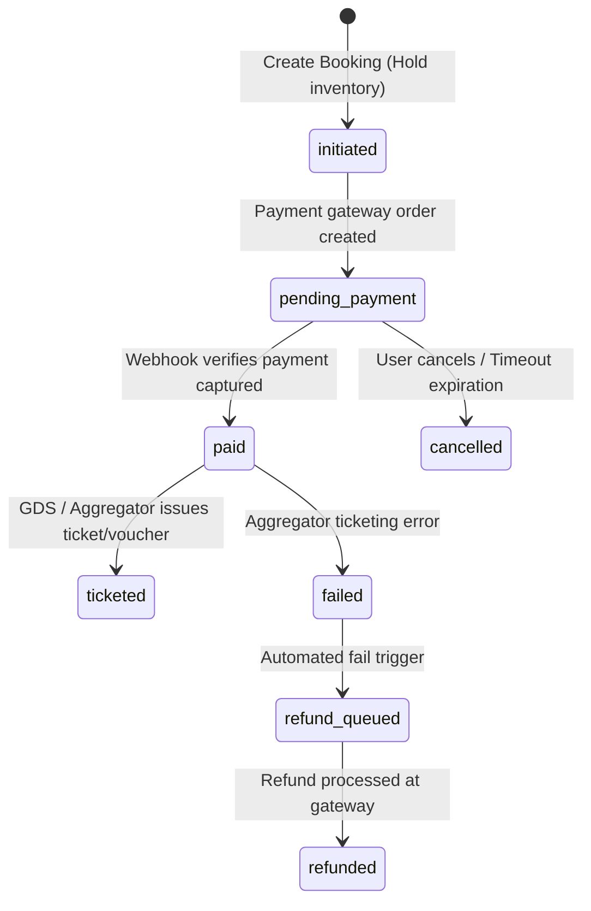

# Bookings Module

The `bookings` module is the central transactional engine of MaqamTravels, orchestrating orders across flights, hotels, tours, and packages.

## Component Map

* **Model:** `Booking` ([booking.model.js](file:///d:/Shashi/MaqamTravelsAlpha/modules/bookings/booking.model.js))
* **Controller:** `bookingController` ([booking.controller.js](file:///d:/Shashi/MaqamTravelsAlpha/modules/bookings/booking.controller.js))
* **Service:** `bookingService` ([booking.service.js](file:///d:/Shashi/MaqamTravelsAlpha/modules/bookings/booking.service.js))
* **Routes:** `bookingRoutes` ([booking.routes.js](file:///d:/Shashi/MaqamTravelsAlpha/modules/bookings/booking.routes.js))
* **Validator:** `bookingValidator` ([booking.validator.js](file:///d:/Shashi/MaqamTravelsAlpha/modules/bookings/booking.validator.js))

---

## Booking State Machine

Bookings follow a strict transactional state machine. Direct status updates are blocked; status modifications must go through state validation routines:

---

## State Descriptions

* **`initiated`:** Temporary record. Holds the seats in GDS / rooms in PMS. Expires if checkout isn't completed within 10-15 minutes.
* **`pending_payment`:** Gateway transactions initiated (e.g. Razorpay Order ID created). Waiting for user transaction completion.
* **`paid`:** User card/account charged. Payment signature verified successfully by our webhook handlers.
* **`ticketed`:** The booking is officially confirmed and travel vouchers/e-tickets are generated. User receives success notifications (email/SMS).
* **`failed`:** Inventory could not be confirmed at the aggregator level despite payment capture. The booking status is marked as failed, triggering an alert to the support queue.
* **`refund_queued` / `refunded`:** Compensational steps to return funds to customer accounts for failed bookings.
